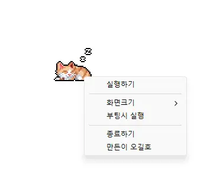

# StayOn

**Un outil gratuit pour Windows qui empêche l'écran de s'éteindre et le PC de se mettre en veille — il suffit de cliquer sur le petit chat du bureau.**

[English](README.md) · [한국어](README.ko.md) · [简体中文](README.zh-CN.md) · [日本語](README.ja.md) · [Español](README.es.md) · [Português (Brasil)](README.pt-BR.md) · Français

> Ce document est une traduction. En cas de différence, la [version coréenne](README.ko.md) fait foi.

## Présentation

Cela vous est sûrement déjà arrivé : une présentation est affichée, un long téléchargement est en cours ou vous lisez un document — et quelques minutes plus tard, l'écran s'éteint et le PC s'endort. Sur un PC de bureau, on ne peut souvent même pas modifier les paramètres d'alimentation.

StayOn place un petit chat en pixel art dans un coin du bureau. **Cliquez sur le chat endormi et il se réveille** ; tant qu'il est éveillé, l'écran ne s'éteint pas et le PC ne se met pas en veille. Cliquez à nouveau : le chat se rendort et tout revient à la normale.

Les paramètres d'alimentation et de veille de Windows ne sont jamais modifiés. L'effet ne dure que pendant l'exécution du programme, et il ne laisse aucune trace après la fermeture ou un redémarrage. Un seul fichier, moins de 100 Ko.

## Fonctionnalités

- **Un seul clic** — Cliquez sur le chat pour activer ou désactiver l'anti‑veille. Le menu contextuel fonctionne aussi.
- **Empêche l'extinction de l'écran, la veille et le verrouillage** — L'économiseur d'écran, l'extinction de l'écran, le mode veille et le verrouillage automatique ne se déclenchent pas. Empêche aussi les messageries comme Teams de vous afficher « Absent ».
- **Aucune modification des paramètres Windows** — Les options d'alimentation et les stratégies de groupe restent intactes. Aucun droit d'administrateur nécessaire.
- **Un chat à placer où vous voulez** — Faites‑le glisser où bon vous semble ; la position est mémorisée. Il ne peut pas sortir de l'écran.
- **Taille 100 % · 200 % · 400 %** — Choisissez la taille du chat selon votre moniteur. Net même sur les écrans haute résolution (HiDPI).
- **Lancer au démarrage** — Le chat apparaît dès le démarrage de Windows (version avec installateur).
- **Léger et simple** — Réécrit en C : un exécutable de 83 Ko, sans assistant d'installation ni fenêtre de réglages. Toujours au premier plan, mais jamais dans la barre des tâches ni dans la liste Alt+Tab.
- **7 langues** — Coréen · anglais · japonais · chinois · russe · italien · français. Suit la langue d'affichage de Windows.

## Téléchargement / Installation

| Type | Lien |
|---|---|
| Installateur | [Télécharger](https://down.kilho.net/stayon?lang=fr) |
| Portable (ZIP) | [Télécharger](https://down.kilho.net/stayon?lang=fr&nosetup) |

Avec l'installateur, le chat apparaît dès la fin de l'installation. Pour la version portable, décompressez le ZIP et lancez `StayOn.exe`.

Différence entre les deux : **Lancer au démarrage** ne peut être activé que dans la version avec installateur (dans la version portable, l'élément de menu est grisé).

## Utilisation

### Déroulement de base

1. Lancez StayOn. Un **chat endormi** apparaît en bas à droite de l'écran, juste au‑dessus de la barre des tâches.
2. **Cliquez** sur le chat. Il s'étire et se réveille ; dès lors, l'écran ne s'éteint plus et le PC ne se met plus en veille.
3. Faites votre travail. Le chat reste à l'écran tant qu'il est éveillé.
4. Quand vous avez terminé, **cliquez à nouveau sur le chat**. Il se rendort et les réglages de veille reviennent à la normale.

Au lancement du programme, le chat **commence toujours endormi**. Même si vous l'avez laissé éveillé hier, il ne s'activera pas tout seul au prochain lancement — ainsi l'écran n'est jamais maintenu allumé sans que vous l'ayez voulu.

### Organisation de l'écran

Pas de fenêtre ni d'écran de réglages : seulement le chat et son **menu contextuel** (clic droit).

| Menu | Rôle |
|---|---|
| **Exécuter** / **Arrêter** | Activer/désactiver l'anti‑veille — identique à un clic sur le chat |
| **Taille** › 100% · 200% · 400% | Taille du chat. 200 % par défaut |
| **Lancer au démarrage** (coché) | Démarrage automatique avec Windows (version avec installateur) |
| **Créé par Kilho** | Ouvrir le site web |
| **Quitter** | Fermer le programme — l'anti‑veille se désactive aussi |

- **Chat endormi** = anti‑veille désactivé, **chat éveillé** = anti‑veille activé. Pas besoin d'autre indicateur : le chat suffit.
- **Glisser pour déplacer** — Maintenez le clic sur le chat et faites‑le glisser. Un tout petit mouvement compte comme un clic.

### Que faire quand…

**Garder l'écran allumé pendant une présentation ou une réunion**
Cliquez une fois sur le chat pour le réveiller avant d'ouvrir vos diapositives. Cliquez à nouveau à la fin. Inutile de toucher aux paramètres d'alimentation du projecteur ou du PC de la salle de réunion.

**Laisser un long téléchargement ou une tâche tourner en votre absence**
Réveillez le chat : le PC ne se mettra pas en veille pendant votre absence et la tâche continuera. Rendormez le chat à votre retour. Cela n'a rien à voir avec l'arrêt du PC : éteignez‑le vous‑même une fois la tâche terminée.

**Teams · Slack me passe sans cesse en « Absent »**
Si vous ne faites que lire ou écouter une réunion sans bouger la souris, les messageries vous marquent absent. Avec le chat éveillé, cela n'arrive pas.

**Je ne peux pas modifier les paramètres d'alimentation sur mon PC de bureau**
StayOn ne modifie pas les paramètres Windows et n'utilise pas de droits d'administrateur. Même sur un PC où le délai d'extinction de l'écran est fixé par stratégie de groupe, l'écran reste allumé tant que le chat est éveillé.

**Le chat me gêne**
- **Faites‑le glisser** où vous voulez. La position est mémorisée.
- Clic droit → **Taille** → **100%** : il se fait presque oublier.
- Le chat ne peut pas être poussé hors de l'écran ; il s'arrête au bord du moniteur.

**Le chat est trop petit (moniteur 4K, etc.)**
Clic droit → **Taille** → **400%**. La valeur est multipliée par la mise à l'échelle de Windows, il reste donc net à toute résolution.

**Faire apparaître le chat à chaque démarrage du PC**
Dans la version avec installateur, clic droit → cochez **Lancer au démarrage**. Dès le prochain démarrage, le chat apparaît endormi après l'ouverture de session. Dans la version portable, cet élément est verrouillé : utilisez la version avec installateur.

**Je ne vois pas le chat**
- S'il est déjà lancé, un second lancement ne fait rien (un seul chat à la fois). Regardez dans les coins de l'écran et sur les autres moniteurs.
- Si votre configuration d'écrans a changé et que la position enregistrée est désormais hors écran, il revient automatiquement à la position par défaut (en bas à droite du moniteur principal).

**Quitter complètement StayOn**
Clic droit → **Quitter**. Si le chat était éveillé, l'anti‑veille se désactive en même temps. Si vous ne faites que rendormir le chat, le programme reste ouvert et vous pourrez le réveiller aussitôt la prochaine fois.

**Vérifier que l'anti‑veille fonctionne**
Si le chat est éveillé, c'est le cas. Pour en être sûr, attendez que le délai d'extinction de l'écran défini dans Paramètres Windows → Système → Alimentation soit dépassé et constatez que l'écran reste allumé.

**Retrouver la même position et la même taille sur un autre PC**
Les réglages sont enregistrés dans votre compte utilisateur et conservés lors des mises à jour. Sur un nouveau PC, déplacez le chat une fois et choisissez une taille : c'est mémorisé.

## Configuration

Pas de fenêtre de réglages : tout se change dans le menu contextuel et s'enregistre immédiatement.

| Élément | Par défaut |
|---|---|
| Taille | 200% |
| Position du chat | En bas à droite du moniteur principal (au‑dessus de la barre des tâches) |
| Lancer au démarrage | Désactivé |
| État de l'anti‑veille | Non enregistré — démarre toujours endormi |

La langue de l'interface suit la langue d'affichage de Windows (coréen · anglais · japonais · chinois · russe · italien · français ; sinon, anglais).

## Configuration requise

- Windows 10 ou Windows 11 (32 et 64 bits)
- Aucun droit d'administrateur ni runtime supplémentaire requis.
- La connexion Internet ne sert qu'à vérifier les nouvelles versions. Fonctionne hors ligne.

## Mises à jour

StayOn ne se met **pas** à jour tout seul. Au lancement, il vérifie si une nouvelle version existe et affiche un avis ; en appuyant sur **Oui**, la page de téléchargement s'ouvre et le programme se ferme. Les nouvelles versions sont publiées manuellement après vérification interne et annoncées sur la [page StayOn](https://v2.kilho.net/stayon). Consultez l'[avis sur la politique de mise à jour](https://en.kilho.net/archives/notice/2940).

**Historique des versions**

| Version | Date | Modifications |
|---|---|---|
| 2.0.0 | 2026-09-21 | Refonte complète pour une structure plus légère et plus fiable (réécrit en C) ; meilleure prévention de l'extinction de l'écran, de la veille et du statut « Absent » de Teams ; taille 100 / 200 / 400 % ; enregistrement automatique de la position et de la taille, meilleur placement multi‑écrans |
| 1.0.2 | 2024-11-25 | Correction d'erreurs Direct2D sur certains PC ; rendu HiDPI plus net |
| 1.0.1 | 2024-11-16 | Ajout de l'italien, du français et du russe |
| 1.0.0 | 2024-11-03 | Amélioration des notifications de mise à jour ; prise en charge multilingue |

## Licence

StayOn est un **freeware**. Utilisez‑le gratuitement et sans restriction partout — au bureau, à la maison, dans les administrations, à l'école — et redistribuez‑le librement.

## Liens

- Site web : <https://v2.kilho.net/stayon>
- Forum : <https://groups.google.com/g/kilhonet>
- X (Twitter) : <https://www.twitter.com/kilhonet>

© KILHO.NET
